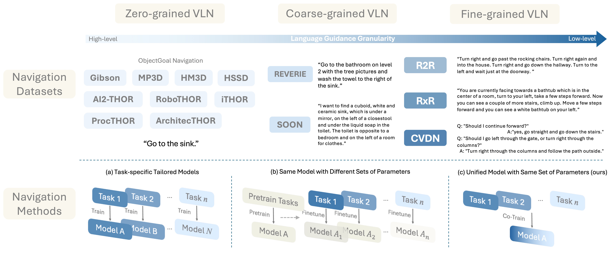
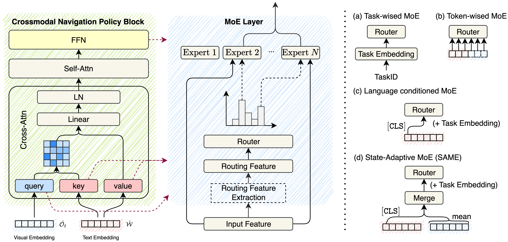

<div align="center">

<h1><span style="background: linear-gradient(to right, #007BA7, #99B5D2); -webkit-background-clip: text; color: transparent;font-style: italic;"> SAME</span>: Learning Generic Language-Guided Visual Navigation with State-Adaptive Mixture of Experts</h1>

<div>
    <a href='https://gengzezhou.github.io' target='_blank'>Gengze Zhou<sup>🍕</sup></a>;
    <a href='http://www.yiconghong.me' target='_blank'>Yicong Hong<sup>🌭</sup></a>;
    <a href='https://zunwang1.github.io' target='_blank'>Zun Wang<sup>🍔</sup></a>;
    <a href='https://github.com/zhaoc5' target='_blank'>Chongyang Zhao<sup>🌮</sup></a>;
    <a href='https://www.cs.unc.edu/~mbansal/' target='_blank'>Mohit Bansal<sup>🍔</sup></a>;
    <a href='http://www.qi-wu.me' target='_blank'>Qi Wu<sup>🍕</sup></a>
</div>
<sup>🍕</sup>AIML, University of Adelaide 
<sup>🌭</sup>Adobe Research 
<sup>🍔</sup>UNC, Chapel Hill
<sup>🌮</sup>UNSW Sydney

<br>

<div>
    <a href='https://github.com/GengzeZhou/SAME' target='_blank'></a>
    <a href='https://arxiv.org/abs/2412.05552' target='_blank'></a>
    <a href="https://opensource.org/licenses/MIT"></a>
</div>

</div>

## 🍹 Abstract
The academic field of learning instruction-guided visual navigation can be generally categorized into high-level category-specific search and low-level language-guided navigation, depending on the granularity of language instruction, in which the former emphasizes the exploration process, while the latter concentrates on following detailed textual commands. Despite the differing focuses of these tasks, the underlying requirements of interpreting instructions, comprehending the surroundings, and inferring action decisions remain consistent.
This paper consolidates diverse navigation tasks into a unified and generic framework -- we investigate the core difficulties of sharing general knowledge and exploiting task-specific capabilities in learning navigation and propose a novel State-Adaptive Mixture of Experts (SAME) model that effectively enables an agent to infer decisions based on different-granularity language and dynamic observations. Powered by SAME, we present a versatile agent capable of addressing seven navigation tasks simultaneously that outperforms or achieves highly comparable performance to task-specific agents.

## 🍸 Method


Figure 1. We consolidate diverse navigation tasks into a unified language-guided navigation framework sorted by language granularity. Previous approaches utilize task-specific designs tailored to address particular types of language instructions, as shown in (a) and (b). In contrast, we propose a versatile system that can interpret and execute arbitrary language instructions as shown in (c).



Figure 2. Illustration of MoE position and experts’ routing methods. SAME routing based on multimodal features from visual observations and language instructions allows the agent to dynamically adapt to environmental visual changes.

## 🍻 TODOs

- [ ] Release SAME finetuning code.
- [ ] Release multi-task co-training data.
- [ ] Release pretrained models weights.
- [ ] Release data preparation scripts.

## 🥂 Acknowledgements
We extend our gratitude to MatterPort 3D for their valuable contributions to the open-source platform and community.

We also acknowledge the significant benefits of using [DUET](https://github.com/cshizhe/VLN-DUET), [ScaleVLN](https://github.com/wz0919/ScaleVLN) and [NaviLLM](https://github.com/zd11024/NaviLLM) in this work. Our thanks go out to the creators of these outstanding projects.

## 🍺 Citation

If you find this work helpful, please consider citing:

```bibtex
@article{zhou2024same,
  title={SAME: Learning Generic Language-Guided Visual Navigation with State-Adaptive Mixture of Experts}, 
  author={Gengze Zhou and Yicong Hong and Zun Wang and Chongyang Zhao and Mohit Bansal and Qi Wu},
  journal={arXiv preprint arXiv:2412.05552},
  year={2024},
}
```
