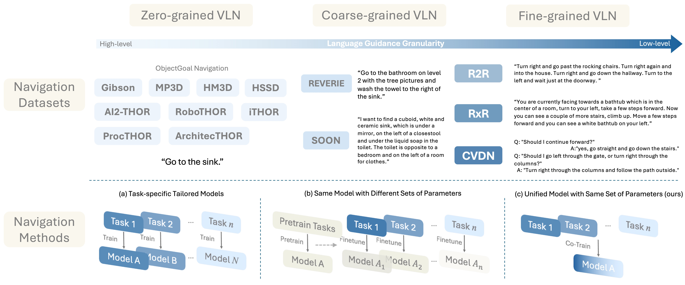
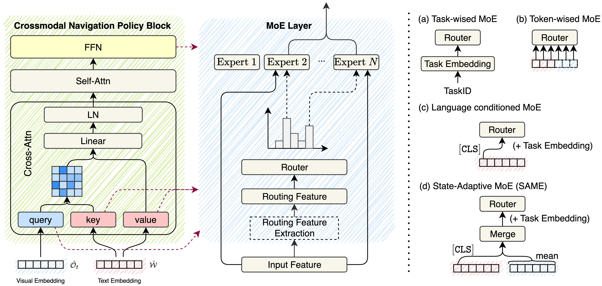

<div align="center">

<h1><span style="background: linear-gradient(to right, #007BA7, #99B5D2); -webkit-background-clip: text; color: transparent;font-style: italic;"> SAME</span>: Learning Generic Language-Guided Visual Navigation with State-Adaptive Mixture of Experts</h1>

<div>
    <a href='https://gengzezhou.github.io' target='_blank'>Gengze Zhou<sup>🍕</sup></a>;
    <a href='http://www.yiconghong.me' target='_blank'>Yicong Hong<sup>🌭</sup></a>;
    <a href='https://zunwang1.github.io' target='_blank'>Zun Wang<sup>🍔</sup></a>;
    <a href='https://github.com/zhaoc5' target='_blank'>Chongyang Zhao<sup>🌮</sup></a>;
    <a href='https://www.cs.unc.edu/~mbansal/' target='_blank'>Mohit Bansal<sup>🍔</sup></a>;
    <a href='http://www.qi-wu.me' target='_blank'>Qi Wu<sup>🍕</sup></a>
</div>
<sup>🍕</sup>AIML, University of Adelaide 
<sup>🌭</sup>Adobe Research 
<sup>🍔</sup>UNC, Chapel Hill
<sup>🌮</sup>UNSW Sydney

<br>

<div>
    <a href='https://github.com/GengzeZhou/SAME' target='_blank'></a>
    <a href='https://arxiv.org/abs/2412.05552' target='_blank'></a>
    <a href="https://opensource.org/licenses/MIT"></a>
</div>

</div>

## 🍹 Abstract
The academic field of learning instruction-guided visual navigation can be generally categorized into high-level category-specific search and low-level language-guided navigation, depending on the granularity of language instruction, in which the former emphasizes the exploration process, while the latter concentrates on following detailed textual commands. Despite the differing focuses of these tasks, the underlying requirements of interpreting instructions, comprehending the surroundings, and inferring action decisions remain consistent.
This paper consolidates diverse navigation tasks into a unified and generic framework -- we investigate the core difficulties of sharing general knowledge and exploiting task-specific capabilities in learning navigation and propose a novel State-Adaptive Mixture of Experts (SAME) model that effectively enables an agent to infer decisions based on different-granularity language and dynamic observations. Powered by SAME, we present a versatile agent capable of addressing seven navigation tasks simultaneously that outperforms or achieves highly comparable performance to task-specific agents.

## 🍸 Method


Figure 1. We consolidate diverse navigation tasks into a unified language-guided navigation framework sorted by language granularity. Previous approaches utilize task-specific designs tailored to address particular types of language instructions, as shown in (a) and (b). In contrast, we propose a versatile system that can interpret and execute arbitrary language instructions as shown in (c).



Figure 2. Illustration of MoE position and experts’ routing methods. SAME routing based on multimodal features from visual observations and language instructions allows the agent to dynamically adapt to environmental visual changes.

## 🍻 TODOs

- [x] Release SAME finetuning code.
- [x] Release multi-task co-training data.
- [x] Release pretrained models weights.
- [ ] Release data preparation scripts.

## 🧋 Prerequisites

### 🍭 Installation

**Note: SAME is simulator-free!** You do not need to install Matterport3D simulator or Habitat simulator. The codebase works entirely with pre-computed visual features and connectivity graphs.

1. Create a conda environment and install all dependencies:

```bash
conda create --name SAME python=3.10
conda activate SAME
pip install -r requirements.txt
```

That's it! No simulator installation required.

## 🍬 Data Preparation

Download the required datasets and features from HuggingFace:

```bash
python download.py --data
```

This script will automatically download all navigation datasets and pre-computed features from [HuggingFace: ZGZzz/VersNav](https://huggingface.co/datasets/ZGZzz/VersNav), including:
- 9 navigation datasets (R2R, REVERIE, RXR-EN, CVDN, SOON, OBJNAV_MP3D + augmented versions)
- Pre-computed CLIP ViT-B/16 visual features for all simulators
- Connectivity graphs for MatterSim, Habitat-MP3D, and Habitat-HM3D

The data directory should be structured as follows:

```
data/
├── simulator/
│   ├── connectivity/                      # MatterSim connectivity graphs
│   ├── habitat_mp3d_connectivity/         # Habitat MP3D connectivity graphs
│   ├── habitat_hm3d_connectivity/         # Habitat HM3D connectivity graphs
│   ├── mp3d_scanvp_candidates.json
│   ├── habitat_mp3d_scanvp_candidates.json
│   ├── habitat_hm3d_scanvp_candidates.json
│   ├── mp3d_connectivity_graphs.json
│   ├── habitat_mp3d_connectivity_graphs.json
│   └── habitat_hm3d_connectivity_graphs.json
├── features/
│   └── img_features/
│       ├── clip_vit-b16_mp3d_hm3d_gibson.hdf5  # CLIP features for MatterSim & HM3D
│       └── MP3D_habitat_clip_b16.lmdb          # CLIP features for MP3D Habitat
├── R2R/
│   ├── R2R_train_mergesim_enc.json
│   ├── R2R_val_train_seen_enc.json
│   ├── R2R_val_seen_enc.json
│   ├── R2R_val_unseen_enc.json
│   ├── R2R_test_enc.json
│   ├── R2R_prevalent_aug_train_enc.json        # PREVALENT augmented data
│   └── R2R_scalevln_aug_train_enc.json         # ScaleVLN augmented data
├── REVERIE/
│   ├── BBoxes.json
│   ├── REVERIE_train_enc.json
│   ├── REVERIE_val_train_seen_enc.json
│   ├── REVERIE_val_seen_enc.json
│   ├── REVERIE_val_unseen_enc.json
│   ├── REVERIE_test_enc.json
│   └── REVERIE_scalevln_aug_train_enc.jsonl    # ScaleVLN augmented data
├── RXR-EN/
│   ├── RXR-EN_train_enc.json
│   ├── RXR-EN_val_seen_enc.json
│   └── RXR-EN_val_unseen_enc.json
├── CVDN/
│   ├── train.json
│   ├── val_seen.json
│   ├── val_unseen.json
│   └── test_cleaned.json
├── SOON/
│   ├── train_enc_pseudo_obj_ade30k_label.jsonl
│   ├── val_unseen_instrs_enc_pseudo_obj_ade30k_label.jsonl
│   ├── val_unseen_house_enc_pseudo_obj_ade30k_label.jsonl
│   └── test_v2_enc.jsonl
└── MP3D/
    ├── habitatweb/                             # Habitat-web human demonstrations for ObjectNav
    │   ├── train/
    │   └── val_train_seen/
    └── v1/
        └── val/
```

## 🍫 Pretrained Models

Download the ScaleVLN pretrained models from HuggingFace:

```bash
# Download all pretrained models
python download.py --pretrain

# Or download specific model
python download.py --pretrain --model attnq    # MoE at Attention Query
python download.py --pretrain --model attnkv   # MoE at Attention Key-Value
python download.py --pretrain --model ffn      # MoE at Feed-Forward Network
```

This will download pretrained checkpoints from [HuggingFace: ZGZzz/SAME](https://huggingface.co/ZGZzz/SAME) to `data/pretrain/`:

```
data/pretrain/
├── Attnq_pretrained_ckpt.pt      # Pretrained model with MoE at Attn_q
├── Attnkv_pretrained_ckpt.pt     # Pretrained model with MoE at Attn_kv (optional)
└── FFN_pretrained_ckpt.pt        # Pretrained model with MoE at FFN (optional)
```

### 📦 Trained Model Checkpoints (Optional)

If you want to use our trained model checkpoints for evaluation:

```bash
python download.py --checkpoints
```

This will download trained model checkpoints from [HuggingFace: ZGZzz/SAME](https://huggingface.co/ZGZzz/SAME) to `data/ckpts/`.

### 🚀 Quick Start: Download Everything

To download all data and models at once:

```bash
python download.py --data --pretrain --checkpoints
```

## 🌟 Key Features

### 🎯 Simulator-Free Architecture

SAME is **completely simulator-free**! The codebase works entirely with:
- Pre-computed CLIP ViT-B/16 visual features
- Pre-built connectivity graphs
- No need to install or run Matterport3D or Habitat simulators

### 🗂️ Multi-Dataset Co-Training

SAME supports **9 different navigation datasets** simultaneously:

**Low-Level Language-Guided Navigation:**
- **R2R** (Room-to-Room): Fine-grained instruction following
- **R2R-PREVALENT**: Augmented R2R with environment dropout
- **R2R-ScaleVLN**: Augmented R2R with HM3D scenes
- **REVERIE**: Remote Embodied Visual Referring Expression in Real Indoor Environments
- **REVERIE-ScaleVLN**: Augmented REVERIE with HM3D scenes
- **RXR-EN**: Multilingual Room-to-Room Navigation (English)

**High-Level Category-Specific Search:**
- **CVDN**: Cooperative Vision-and-Dialog Navigation
- **SOON**: Semantic Object-Oriented Navigation
- **ObjectNav-MP3D**: Object Navigation in Matterport3D

Configure dataset sampling ratios in the config file:

```yaml
task:
  source: ['R2R_SCALEVLN', 'R2R_PREVALENT', 'R2R', 'REVERIE_SCALEVLN',
           'REVERIE', 'RXR-EN', 'CVDN', 'SOON', 'OBJNAV_MP3D']
  ratio: [20, 1, 1, 10, 1, 1, 1, 1, 2]  # Sampling ratios
```

### 🎨 Multi-Observation Support

SAME supports features from **multiple simulators/renderers**:

1. **MatterSim**: Original Matterport3D panoramic renderer
   - Used for: R2R, REVERIE, RXR-EN, CVDN, SOON

2. **Habitat-MP3D**: Habitat simulator with MP3D scenes
   - Used for: ObjectNav-MP3D, alternative R2R training

3. **Habitat-HM3D**: Habitat simulator with HM3D scenes
   - Used for: ScaleVLN augmented datasets

Configure simulation environments per dataset:

```yaml
task:
  train_simulation_env:
    "R2R": ["mattersim", "mp3d_habitat"]  # Can use multiple renderers
    "R2R_SCALEVLN": "hm3d_habitat"
    "OBJNAV_MP3D": "mp3d_habitat"
  eval_simulation_env:
    "R2R": "mattersim"
    "OBJNAV_MP3D": "mp3d_habitat"
```

### 🧠 State-Adaptive Mixture of Experts (MoE)

SAME introduces **task-based MoE routing** that adapts to different navigation tasks:

**MoE Position Options:**
- `Attn_q`: MoE on attention query projection
- `Attn_kv`: MoE on attention key-value projections
- `FFN`: MoE on feed-forward network

**Routing Feature Options:**
- `cls`: Text [CLS] token embedding
- `mean`: Mean-pooled text embeddings
- `multi`: **Fused multimodal (text + visual) embeddings** ⭐ Best performance
- `task_id`: Task embeddings
- `task_id_cls`: Task embedding + text [CLS]
- `task_id_multi`: Task embedding + multimodal features

Configuration example:

```yaml
model:
  use_moe_layer: true
  moe_type: "Task"              # Task-based or Sparse
  moe_position: "Attn_q"        # Attn_q, Attn_kv, or FFN
  task_routing_feature: "multi" # Routing based on multimodal features
  num_experts: 8
  num_experts_per_tok: 2        # Top-2 expert selection
  router_aux_loss_coef: 0.8
```

## 🎯 Configuration Guide

SAME uses **OmegaConf** for hierarchical configuration management.

### Configuration Hierarchy

1. **`configs/default.yaml`**: Base configuration with all default settings
2. **`configs/main_multi_q.yaml`**: Main experiment config (overrides defaults)
3. **Command-line `--options`**: Runtime overrides (highest priority)

### Key Configuration Sections

#### 1. Experiment Settings

```yaml
experiment:
  id: "experiment_name"        # Experiment identifier
  output_dir: "output"         # Output directory
  data_dir: "../data"          # Data root directory
  seed: 42                     # Random seed
  resume_file: null            # Checkpoint to resume from
  test: false                  # Test mode (no training)
  eval_first: true             # Evaluate before training
```

#### 2. Model Configuration

```yaml
model:
  num_l_layers: 9              # Language encoder layers
  num_pano_layers: 2           # Panorama encoder layers
  num_x_layers: 4              # Cross-attention layers
  graph_sprels: true           # Use spatial relations
  pretrained_ckpt: "../data/pretrain/Attnkv_pretrained_ckpt.pt"

  # MoE Settings
  use_moe_layer: true
  moe_position: "Attn_q"       # or "Attn_kv" or "FFN"
  task_routing_feature: "multi"
  num_experts: 8
  num_experts_per_tok: 2
```

#### 3. Training Configuration

```yaml
training:
  iters: 500000                # Total training iterations
  num_iters_per_epoch: 5000    # Iterations per epoch
  batch_size: 16               # Training batch size
  val_batch_size: 32           # Validation batch size
  learning_rate: 0.00001       # Learning rate
  feedback: "sample"           # teacher, sample, or argmax
  train_alg: "dagger"          # imitation or dagger
  workers: 4                   # DataLoader workers
```

#### 4. Multi-Dataset Configuration

```yaml
task:
  source: ['R2R_SCALEVLN', 'R2R_PREVALENT', 'R2R', 'REVERIE_SCALEVLN',
           'REVERIE', 'RXR-EN', 'CVDN', 'SOON', 'OBJNAV_MP3D']
  ratio: [10, 1, 1, 1, 1, 1, 1, 1, 2]  # Dataset sampling ratios

  # Specify simulator for each dataset
  train_simulation_env:
    "R2R": ["mattersim", "mp3d_habitat"]  # Multiple simulators!
    "R2R_SCALEVLN": "hm3d_habitat"
    "REVERIE": "mattersim"
    "OBJNAV_MP3D": "mp3d_habitat"
```

### Using Different Configurations

Override config values via command line:

```bash
cd src
python run.py --config_dir configs/main_multi_q.yaml \
  --options training.batch_size=32 \
  model.num_experts=16 \
  experiment.seed=123
```

## 🍹 Training

### Basic Training

Train with the main multi-task configuration:

```bash
cd src
python run.py --config_dir configs/main_multi_q.yaml
```

This will:
- Load pretrained checkpoint from `data/pretrain/Attnq_pretrained_ckpt.pt`
- Train on all 9 datasets with configured sampling ratios
- Evaluate on validation sets before training (`eval_first: true`)
- Save checkpoints to `output/TaskMoE-multi-q/ckpts/`

### Multi-GPU Distributed Training

```bash
cd src
torchrun \
  --nproc_per_node=4 \
  --master_port=29500 \
  run.py --config_dir configs/main_multi_q.yaml
```

### Customizing Training

Customize hyperparameters via command line:

```bash
cd src
python run.py --config_dir configs/main_multi_q.yaml \
  --options training.batch_size=32 \
  training.learning_rate=0.00005 \
  experiment.seed=42
```

### Training with Different MoE Positions

Train with MoE at different positions:

```bash
# MoE at Attention Key-Value
python run.py --config_dir configs/main_multi_kv.yaml

# MoE at Feed-Forward Network
python run.py --config_dir configs/main_multi_FFN.yaml
```

## 🧪 Testing

Evaluate a trained model on validation/test splits:

```bash
cd src
python run.py --config_dir configs/test.yaml \
  --options experiment.resume_file=/path/to/checkpoint.pt
```

Or create a test config file:

```yaml
# configs/test.yaml
experiment:
  id: "test"
  test: true
  resume_file: "output/TaskMoE-multi-q/ckpts/epoch_xx.pt"

training:
  val_batch_size: 32
  workers: 4

model:
  moe_position: "Attn_q"
  pretrained_ckpt: "../data/pretrain/Attnq_pretrained_ckpt.pt"
  task_routing_feature: "multi"
```

Then run:

```bash
cd src
python run.py --config_dir configs/test.yaml
```

### Evaluation Metrics

SAME evaluates on multiple metrics:
- **SR** (Success Rate): Percentage of successful navigations
- **SPL** (Success weighted by Path Length): Efficiency metric
- **nDTW** (normalized Dynamic Time Warping): Path similarity to ground truth
- **NE** (Navigation Error): Distance to goal at end
- **OSR** (Oracle Success Rate): Success rate with oracle stop

Results are saved in the output directory and logged to console.

## 🥂 Acknowledgements
We extend our gratitude to MatterPort 3D for their valuable contributions to the open-source platform and community.

We also acknowledge the significant benefits of using [DUET](https://github.com/cshizhe/VLN-DUET), [ScaleVLN](https://github.com/wz0919/ScaleVLN) and [NaviLLM](https://github.com/zd11024/NaviLLM) in this work. Our thanks go out to the creators of these outstanding projects.

## 🍺 Citation

If you find this work helpful, please consider citing:

```bibtex
@article{zhou2024same,
  title={SAME: Learning Generic Language-Guided Visual Navigation with State-Adaptive Mixture of Experts}, 
  author={Gengze Zhou and Yicong Hong and Zun Wang and Chongyang Zhao and Mohit Bansal and Qi Wu},
  journal={arXiv preprint arXiv:2412.05552},
  year={2024},
}
```
